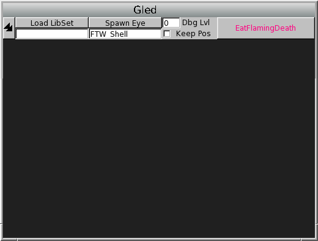
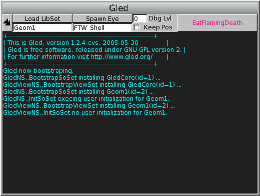
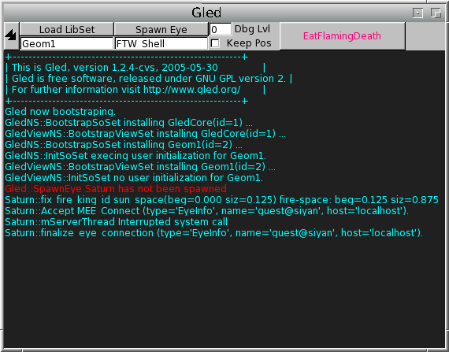
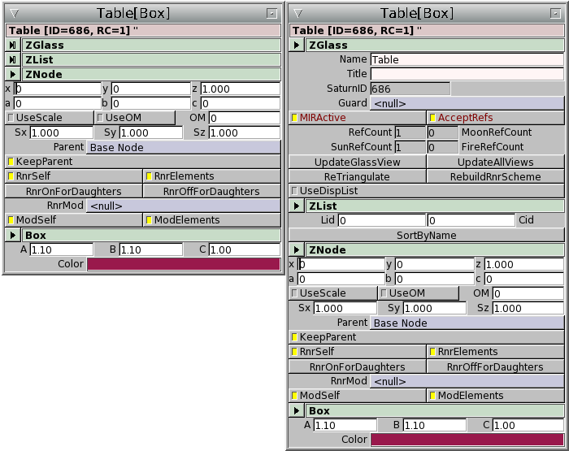
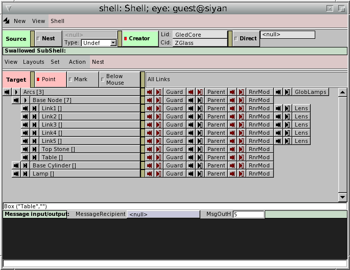
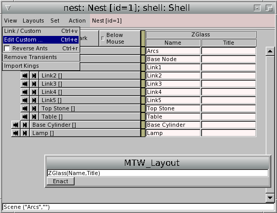
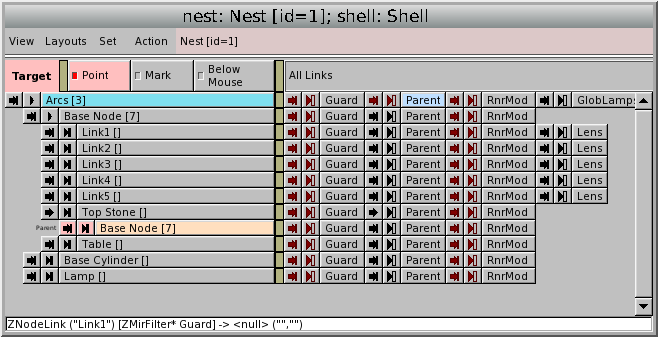
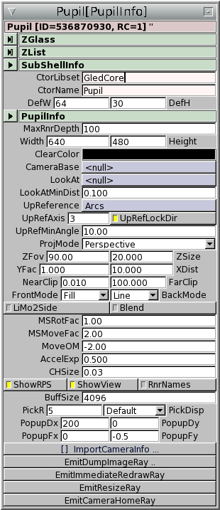
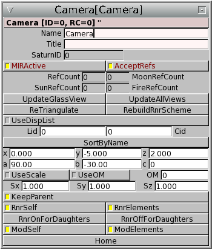

# STATUS

Last edited in June 2005. Converted in 2026 from the HTML on www.gled.org;
the source document is lost.

# Gled GUI

*Partially revised for Gled version 1.5, June 2005. Expect new version with
better tutorial section soon.*

The graphical user interface is one of the central components of the `Gled`
system. For every public member variable or method, a GUI component can be
requested in the source. These components are `FLTK` widgets that can be
composed in different ways. `Gled` provides one such mode, called the
Monitor - it is the standar GUI that the user gets when `Gled` is started
with its interactive GUI component, the Eye, enabled. The monitor presents
(1) FullView windows, where all the component widgets of a given lens
(object instance) are presented, ordered by the C++ class inheritence, (2)
Nests windows, where the object graphs (inter-object relationships composed
of various containers and links, ie. pointers to other `ZGlass`-descendent
objects) are presented, method-browser menus with method invocation request
dialogues, and the 3D rendering window, called the `Pupil`. The Eye is the
viewer that completes the server-proxy-client into the complete `Gled`
runtime system.

But the Monitor is just the default way of using the component widgets; it
is optimized for development and prototyping. The Eye is capable of using
structures in the object-collection as instructions for component-widget
layaout - this is called the MetaGUI and is implemented directly in the core
`Gled` system. MetaGUI allows for almost arbitrary composition of components
so that thy can be used as customizations to facilitate the use of the
Monitor GUI, or to compose an application GUI for the end user.

All this can be achieved using scripts, datafiles or user interaction, with
component widgets, that have been auto-generated based on programmers
requests in the source - without any need for direct coding of the widgets
and GUI. Of course, the interfaces can be extended further via subclassing
of the Eye, but this should be rarely needed.

`Gled` can be used also without any GUI component at all since `Gled`
provides two executables. The `saturn` executable is compiled with no GUI
support and is intended for non-interactive jobs, worker nodes, remote
server nodes in the cluster hierarchy etc. It optionaly provides interactive
command-line `CINT` interface but is otherwise restricted to network access.

The other `Gled` executable is called `gled` - this is the default
executable, compiled with full GUI support. When starting, by default it
opens a graphical message & control window for the server-proxy-client (ie.
saturn) alongside th interactive command-line `CINT` shell that is opened
the terminal. The message and control window is not yet part of the Eye, the
GUI compontent itself.

## Saturn control window and Eye

A simple saturn instance with graphical message & control window will be
started simply by invoking `gled` with no command-line options, like this:

       $ gled
        Staring ROOT command-line interpreter ...
          *******************************************
          *                                         *
          *        W E L C O M E  to  R O O T       *
          *                                         *
          *   Version   4.03/04      8 April 2005   *
          *                                         *
          *  You are welcome to visit our Web site  *
          *          http://root.cern.ch            *
          *                                         *
          *******************************************
        
        FreeType Engine v2.1.3 used to render TrueType fonts.
        Compiled for linux with thread support.
        
        CINT/ROOT C/C++ Interpreter version 5.15.169, Mar 14 2005
        Type ? for help. Commands must be C++ statements.
        Enclose multiple statements between { }.
        Use context menu in Nest to import lenses as CINT variables.
        gled[0] 

Since `Gled` is a `ROOT` application, you get to see `ROOT`'s welcome
message, then the `CINT` interpreter starts at the terminal and welcomes you
with a `gled` prompt. Then, the saturn control window opens.

**Saturn control window.** Saturn control window consists of a row of control buttons where you can set
the font/widget scale (the double-arrow button), load a new library set,
start a new Eye, adjust window positioning an debuggin levels, and close the
application.

Bellow is the saturn message console where events and debugging messages are
reported.

Note that you can suppress the saturn control window with the `-nomsgwin`
command line option. Messages for the message console can be redirected to a
file using the `-log` option. See `gled --help` for more options.

The saturn control window has two important widgets: one for loading new
libsets, and the other for spawning new Eyes (GUI components). (The
strangley named button simply terminates the application.) There is also the
debbugging setting and a check button for windowmanager layout control.

Loading new libsets is easy, if you know what is available. Simply enter the
correct libset name in the text-input widget and click on the `Load LibSet`
button. For example, try loading the basic geometry library, `Geom1`.

**Loading libsets with saturn control window.** To load a new library set, simply enter its name and press `Load LibSet`.
Messages reporting the loading process should appear in the message console
window.

If you have an Eye running when you load a new libset, the new libset
immediately becomes available under the `Creator` menu so you can
instantiate lenses from it.

Note that when you are connecting to a running instance of `Gled`, necessary
libsets are loaded automatically when dependencies are resolved.

Starting an Eye is sligthly more tricky, since it needs the saturn's server
(ie. Sun) to be running before it can start. If you try to start it before,
you will get an error saying: `Gled::SpawnEye Saturn has not been spawned.`
Usually demo files and applications do all the Sun and Eye startup for you,
but you can also do it by hand. If you followed the previous example, all
you have to do now is invoke the following command in the `CINT`:

       gled[0] Gled::theOne->SpawnSun();

Now you can press the `SpawnEye` button and a new window will appear.

**Spawning the Sun and the Eye.** After trying to spawn an Eye without a running Sun (see error message in
red), a Sun was started from the `CINT` interactive seesion and then a new
Eye was spawned with the `SpawnEye` button. The value ` FTW_Shell `
determines the default content of the Eye's Shell (see further, [Anatomy of
the Eye](#anatomy-of-the-eye).

If you want to spawn the Sun and an Eye directly from the command line or a
startup script, you can use the two scripts `sun.C` and `eye.C` which spawn
a Sun and an Eye respectively, and provide some handy settings. You can call
the two scripts directly on the command line simply by mentioning their name
(they should be always available since they are stored in `Gled`'s global
macro director):

       $ gled sun.C eye.C
        Staring ROOT command-line interpreter ...
          *******************************************
          *                                         *
          *        W E L C O M E  to  R O O T       *
          *                                         *
          *   Version   4.03/04      8 April 2005   *
          *                                         *
          *  You are welcome to visit our Web site  *
          *          http://root.cern.ch            *
          *                                         *
          *******************************************
        
        FreeType Engine v2.1.3 used to render TrueType fonts.
        Compiled for linux with thread support.
        
        CINT/ROOT C/C++ Interpreter version 5.15.169, Mar 14 2005
        Type ? for help. Commands must be C++ statements.
        Enclose multiple statements between { }.
        Use context menu in Nest to import lenses as CINT variables.
        gled[0] 
        Processing sun.C...
        Processing eye.C...
        gled[2]

This should start the server, open the Eye's GUI windows and also spawn a
Pupil (a 3D rendering window). Not much will be seen, of course, since there
are no renderable objects loaded.

The underlying architecture of the GUI is fully decoupled from the
client-server, permitting more than one Eye per Saturn. This means that you
can spawn a new Eye even when one is already running.

For more details on Eye class and the ways to custmize it via sublassing,
see [gledparadigms](gledparadigms.html) and [gledarch](gledarch.html) for
details.)

## Anatomy of the Eye

The Eye runs in the `Gled` application as an independent thread. It has
direct read-access to the object collection, but can only interact with it
through the method invocation request (MIR) interface - it behaves very much
as if requests are coming from another saturn in the server-proxy-client
cluster hierarchy. It also recieves update requests called `ray`s. This
allows the Eye to perform updates when data is changed, thus making it a
completely interactive viewer interface.

The Eye opens its own top-level window, called the **Shell**. The `Shell`
contains the main status bar and message console of the Eye, and by default
it embeds an object browser - called a **Nest**. The Shell allows any number
of additional Nests (object browsers) to be used and can spawn any number of
interactive GL rendering windows called **Pupils**. Both Nests and Pupils
are descendants of class `SubShell` and are managed by the `Shell`.

The `Shell` controls many properties of the other GUI elements, most notably
`FullView` presentation and `Nest` locator use. For details for `FullView`s,
see [Full views](#full-views). For details for `Nest`s, see [Shell and
Nests](#shell-and-nests).

The `Pupil` provides 3D camera navigation and rendering control, but it also
allows for direct object interacion and render-graph browsing with the
`Pupil Contex Menu`, accessible via mouse right-click on an object in the
viewport.

By double-clicking an object label in the Nest window or its rendering in
the Pupil (interactive GL render view window) a **FullView** of the lens
(the instance of a gled object or Glass) can be opened. Lens FullViews are
automatically built from autogenerated widget components for GUI-exported
object member variables and methods of the lens. This allows fast object
inspection and editing, and the individual widgets for member variables and
methods can be used in different contexts, as explained later ([Nest
basics](#nest-basics).

Some widgets spawn their own utility windows (dialogs, color-pickers etc.).

Any widgets that represent a lens in some way have a **Lens Context Menu**
(accessible via right-mouse click). The context menu has options to open a
FullView of the lens, to open the Lens in a Nest browser and submenus for
access to object methods of the lens and its autogenerated accessor methods.
This makes the Lens Context Menu a very poverful access point for the user.

**Drag-and-drop** is the easiest way of setting links and manipulating
lists. Wherever a labelled button is used to represent a lens, it can be
dragged to a link or a list to set the link or add the lens to the list.
Rosy titlebars of `FullView`, `Nest` and `Shell` widgets can also be used as
draggable source. For targets, besides links and lists, lenses can be
dragged on another lens to add it after the lens in a list, on a list to add
it into it, and on a method call button where the lens becomes the beta
argument of the method call.

**Paste** (middle mouse button) is also supported - it alway perfroms an
insert (acutally, `push`) command with the Shell's source. Thus it can be
used with locators or with the creator: it is probably the easiest way to
place several new lenses.

It should be noted that `Gled`, even in GUI-mode, still runs the `CINT`
interactive C/C++ interpreter in the terminal where it was started from. The
use of the `CINT` interactive session with GUI is facilitated with the
ability to export any lens via its Lens Context Menu. Additionally, a
drag-and-drop action from an object label to any text-terminal (including
`CINT`) will paste the lens ID. (More info: [Using the lens and link
labels](#using-the-lens-and-link-labels)). Note also that `CINT` implements
GNU-Readline-like command line editing and completion, including completion
on `C++` object methods and members. (See `ROOT` documentation for
reference, <http://root.cern.ch/root/Cint.html>.)

The best way to learn using `Gled` GUI is to start using it. For this
purpose, we will provide a set of examples, recipies and tutorials in the
rest of this document.

First, we have to start `Gled` and load a simple demo scene. Find your
`Gled` installation directory, change directory to the `GledCore` demos and
load `arc.C`, preferably with authentication disabled (so that we don't have
to learn about premissions just yet):

       cd $GLEDSYS
        cd demos/GledCore
        gled --help # if you want to see all the options
        gled -noauth arc.C

The result should look very much like the following screenshot. Try
double-clicking on the red box in the `Pupil` to get the `FullView` of the
object, just like in the screenshot. (You can hide it by pressing `ESC` in
the window or you can use the window manager to close it.)

This should be practical for the following section on full view GUI.

**`Gled` windows.** The basic elemement of `Gled` GUI, such as you get if you run the demo
`arc.C`, ie. by doing `cd ``$GLEDSYS``/demos/GledCore; gled -noauth arc.C`.
The windows in clockwise order from top rigth are: the `Gled` server message
and control window, the terminal window running interactive CINT session
(bottom-right), the `Shell` with a swallowed `Nest` (bottom-left) and a
`Pupil` (GL interactive rendeing window, top-left). Superimposed over the
server message and control window is a `FullView` of an object, in this case
the Table. It can be oppened by double clicking on the rendering of the
object (the red block in the middle of the viewport) or on the labelled
button in the `Nest`.

Bluish buttons represent links. (Links can be turned off in full view
windows since you might want to manipulate them in the `Nest` instead.) You
can set them by dragging and use the lens contex menu on them (mouse
right-click).

# Full views

Full view is composed of all widgets for a given lens, organised in a
vertical structure which follows the class hierarchy of the lens. By
default, every class is separated by its own header. The header have
collapsors, so that you can hide classes that you do not need. By default,
`ZGlass` and `ZList`, the two most commonly used base classes, are collapsed
to conserve your desktop space.

**Full view - decollapsed.** Full view windows present public member variables and methods with widgets,
as instructed in the source. They are organized vertically by C++ class. On
the top, lens (gled object instance) information is presented in the
draggable yellow widget. Following are class sections. Each class begins
with a title that serves as a decollapsor. As you can see, `ZGlass` and
`ZList`, the two most used base classes, are collapsed by default.

The specifics of how the full views are handled are defined by the relevant
settings in the `ShellInfo`.

To access the `ShellInfo` of the current Shell, you can double-click the
pinkish area of the Shell control or use the right-click contex menu comman
`Open Full View`.

You should do so now to try out the options for full views. Change an option
and open a new full view by double-clicking on a lens label or a rendered
object. Notice how even if you hide a full view with `ESC`, it does not
change when you change the options, but any new full views will come up with
the new options. This is because the windows are not destroyed, only hidden.
If you want to discard all full views and recreate them with new settings,
you should use the command `Remove transients` in the Nest's `View` menu.

It is best to leave the links (violet) alone for now - they are explained in
the section [Shell and Nests](#shell-and-nests).

**`ShellInfo` - control for the Shell.** The links (in violet) mostly control the state of the Shell, used by Nests
for object-collection editing, and several member variables define default
and current properties of the Shell widget - these are covered in [Shell and
Nests](#shell-and-nests). But `FancyGlassView`, `CollZGlass`, `CollZList`
and `ShowLinksInClassView` control whether class sections and collapsors are
rendered, whether `ZGlass` and `ZList` are collapsed by default, and whether
links are shown in class views, respectively.

## Overview of main classes

### `ZGlass` full view

Since all lenses are ZGlass descendants, all full views start with the
standard ZGlass member-variable widgets `Name` and `Title`. These are
read-write widgets so you can easily edit names and titles of lenses. (They
are also available in the nest's predefined custom view under
`Nest->View>Predef Custom->ZGlass`.)

The `SaturnID` is a read-only value, representing the ID of the current lens
in the object ID space (good for debugging, etc.)

Each ZGlass has a read-only boolean indicator MIRActive which shows whether
the lens is currently accepting MIRs.

### `ZList` full view

Many glasses inherit from `ZList` but `ZList` itself has no visible widgets
int the full view. You can access the list members using nest's list view.
In the future, `ZLists` may be limited to allow only a defined glass of list
members and this setting will be presented as a widget in the full view.

### `ZNode` full view

`ZNode` contains relative positional offset represented with the `Pos`
widget which contains three sub-widgets, `x`, `y` and `z` and relative
rotational offset represented with the `Rot` widget which contains three
sub-widgets, `a`, `b` and `c`. (These widgets are also available in the
nest's predefined custom view under `Nest->View>Predef Custom->ZNode`.)

`ZNest` implements an object tree using links and lists. A `ZList`
descendant it stores its children as list members and its parent as the
value of the `Parent` link. It's full view contains the `KeepParent` boolean
toggle which controls whether the `ZNode` should keep its previous parent
when it becomes member of a new list, or the parent should be changed to the
new list.

# Shell and Nests

The Shell is the top-level interaction window. It contains the shell part,
where shell's global settings for *source* and *sink* ([Object collection
editing with Nest](#object-collection-editing-with-nest)) of the current Eye
are located (sink is hidden by default); under the shell part of the Shell
window, a swallowed Nest is located. The Nest contains target settings
(local to each Nest) and Nest menus. Note that any number of bare Nest
windows and new Pupil windows can be spawned using the nest `New->New Nest`
and `New->New Pupil` menu option in the Shell.

**Shell contains a nest and a message window.** The Shell is the top-level interaction window. It is composed of three
components: on the top, the Shell control is located. At the bottom is the
Message Input/Output console. Between them, the Shell presents a swallowed
subshell, by default a Nest (as in this picture).

The Shell control has the widget resize button where all the widgets in the
current Eye can be resized, and tow menus: `New` offers the creation of new
Nests and new Pupils. `View` controlls what is show in the rest of Shell
control: by default, `source` is displayed and set to `creator`, but `sink`
is hidden and set to `/dev/null`.

The Shell's Message Input/Output console at the bottom receives messages for
the Eye, including errors and "access denied" messages when GUI commands are
invoked. The last line (in white) is message input where the user can send
messages to objects.

The main part of the Shell window is a swallowed widget, by default a Nest
(object graph browsing widget), further explained bellow.

The bottom part is a Message input/outuptg console for the Eye. This is
errors and "access denied" messages for GUI commands are displayed. In fact,
any message for the Eye object will appear here. You can address any message
to any object simply by inputing the message in the lower, white part of
console. Prefix the message with the name of the object a colon. Using the
name of another Eye sends the message directly to that Eye's console - this
can be used for simple message exchange with other Gled users.

\[This is not really true int his version anymore\]

## Nest basics

The main widget of Nest is the object graph browser. The left part shows a
tree-like view of the object collection, where every lens is represented
with labelled button with its `Name` and, if it is a ZList or descendant,
the number of list-memeber in braces. On the right side, either the links
for each lens can be shown (default; these are called `Ants`) or a custom
selection of object-view widgets for the lenses. This can be toggled with
`View->Links/Custom` menu action (or `ctrl-v`, all keyboard shortcuts are
shown next to the menu labels). The custom view can be edited with the
`View->Edit Custom` command ([Editing and setting custom lens
views](#editing-and-setting-custom-lens-views)).

Some useful predefined custom views are available in the `Layouts` menu.
These are usually ordered in submenus according to their libsets and are
provided by the libsets. But in fact, they are defined by an
object-collection, which can be simply modified by the GUI. For more info,
see [Mastering layouts](#mastering-layouts).

The custom views allow for good control over which member values can be
manipulated and which methods can be called directly from the Nest, and thus
the Nest is quite an efficient specialised editor.

**Nest with custom view.** The nest on this screenshot has been configured with a custom view of *Name*
and *Title* for `ZGlass` (see dialog mislabelled MTW_Layout; this is the
default custom value in the editor). To generate a custom view, you can
specify any number of class names, followed by comma-sperated list of member
variables or methods in parentheses, and separated by colons.

The `View` menu is displayed where custom views can be selected and the
editing dialog called.

### Resizing

The double-diagonal-arrow resizer button opens a size-control dialog for
resizing all widgets of the current Eye (size is based on the size of fonts;
useful for viewing complex object collections on limited screen estates).
Note that a global resizer button on the main message console controls the
whole `Gled` instance.

The button with two vertical bars (resembling a pause on audio devices)
opens a control widget that you can use to set the size of table columns for
the widgets in the nest.

### Link and list collapsors

Each lens in the browser is represented by a labelled button (the name of
the label is the `Name` member variable of the lens). Double-clicking on the
label will open the full-view window for the lens, where all the widgets
generated for its member values and methods are shown.

The label is preceded by two collapsors. The right one is *list collapsor*:
it will toggle the display of all list members of the lens (you can think of
list-members as folder contents of standard file-system tree browsers). The
left one is *link collapsor*: It will toggle the display of all non-null
links. Note that links precede lists if both are open, and each link is
preceded with the link name.

This permits fast browsing of lens aggregations using both link and list
aggregations methods. But as lens aggregates are not necessarily tree
structures the resulting graphs can be circular and it is for that reason,
lens aggregations are not represented as tree widget. (Note also that
`ZNode` lenses *do* form a tree structure with their list contents, and
their parents can be accessed through the `Parent` link.)

**List and link (de)collapsors and decollapsed contents.** On the left in the lens-list, the arrow-shaped *link collapsor* and
triangle-shaped *link collapsor* icons are marked. On the right, two
different arrow-shaped icons are used for the link decollapsor and link-list
decollapsor (the latter dereferences the link to the list, and decollapses
also the list: this is a very common operation, thus this shortcut is
provided.) A decollapsed link can be clearly distinguished by the link name,
which is marked in front of the lens widget. Note how icons change when
decollapsed. The icons are dark red when inactive, showing that there is no
contents to show (decollapse).

### Link display

By default, the link display (on the right) lists all links of the lens with
link names for labels. Each label is preceded by two collapsors - the first
collapsor toggles the display of this link's contents on the left part of
the lens browser, while the second one toggles also the display of list
contents for links to lists (one level deeper).

Both link collapsors are dark-red when the link is null. The right callapsor
is red when the link does not point to a list.

### Editing and setting custom lens views

Custom lens view display can be edited with `View->Edit Custom` menu action.
Syntax for custom view for a class is
`<class_name>(member_name[{width}][,member1_name[{width}]])`. You can
specify multiple classes, using a colon to separate them. Example for
displaying the name for all lenses and radius and LOD of all Spheres:

       ZGlass(Name[10]):Sphere(Radius,LOD[4])

Do not forget that `Custom` has to be enabled for this to have any effect.
You should get this result:

Note that the custom view widgets will work just as well as the
corresponding widgets of the full view windows. This is good for quick
editing of lenses.

A number of predefined custom views can be selected in the menu `Layouts`.

### `ZNode` custom view

ZNode custom view, available as one of the predefined views, is a slightly
special case. It would be specified as follows:

       ZNode(Pos,Rot)

The difficult part is that the `Pos` gled-widget is composed of three
number-input fltk-widgets for *x*, *y* and *z* offsets of the `ZNode`, and
the `Rot` widget is in the same way composed of *a*, *b* and *c* rotation
angels. This can be misleading since both widgets display their internal
labels and *Pos* and *Rot* never appear as labels in the lens' full-view
window.

On the other hand, these widgets are prefect for rapid scene editing.

### Mastering layouts

Section missing. XXX

### Using the lens and link labels

Double-clicking on a lens label will open the full-view window for that
lens. Double clicking on a link label will dereference the link and open the
full view window for the lens the link is pointing to.

Right clicking on the label will open a context menu (the locator menu). The
first level offers some utility functionality (setting the lens to source
and sink, setting "Beta" and "Gamma" links on current nest and exporting it
to a variable accessible from `CINT`, where a dialog will prompt you for a
variable name to export the lens to). The `Method` sub-menu contains a menu
per class from the glass inheritance tree of the lens, listing all methods
from each class.

## Object collection editing with Nest

### Target, Source, Sink

`Gled` methods can be called using the MIR (method invocation request)
mechanism. A MIR uses a specific calling environment, called a *context*.
All GUI actions are realized as MIR calls from the Eye, and method arguments
are passed as elements of the MIR context. (For more information about MIR
context and routing see [Propagation of Light in
gledparadigms](gledparadigms.html#Propagation_of_Light).)

MIR context elements are *caller* (when using the GUI, this is always the
Eye), *recipient* (the Saturn on which the method has to be authenticated
for beamed MIRs), *alpha* (always used for the lens for which the MIR is
sent) and two "positional" context elements, *beta* and *gamma* (the
"arguments"). While general MIR calls can be built in the GUI using the
"Beta" and "Gamma" links of the current shell's ShellInfo, the standard GUI
actions will build MIR calls automatically for the user.

The Nest with its interface for lens graph manipulation uses three different
concepts for stating the purpose of a GUI action: *target*, *source* and
*sink*.

**Target** points to the lens for which the MIR is sent (the target lens
therefore becomes the alpha of the MIR context). For GUI actions, this is
the lens that gets modified.

**Source** is the lens argument used for those GUI actions that set a link
(`Set Link`) or add to a list, (ie. `Push`, `Unshift` and `Insert`). For any
of these actions, source must point to something with lens contents.

**Sink** is used with the `Yank` command which takes target and adds it at
the end of the list sink is pointing to.

### Setting target, source and sink with locators

`Gled` GUI provides several ways to set target, source and sink: two special
selections or *locators* can be used, called *point* and *mark*, and for the
target, the *bellow mouse* "virtual locator" is also available. It is
important to distinguish target, source, and sink from locators. The user
can control which locator is active for which function with the target
selection widget on each Nest (since Target is nest-specific) and similar
widgets for source and sink on the Shell.

**Important**: Locators (point and mark) are indicated with color feedback
on labels, while target, source and sink are indicated with color feedback
on collapsors. The colors correspond with the colors on the control widgets.

The `Bellow Mouse` setting can only be used for target. For source, there is
a special option for creating new lenses: *Creator* (see [Creating
lenses](#creating-lenses)). Sink also provides a special option:
`/dev/null` - in this case, removal commands do not move the lenses, but
delete them instead. (This is the default.)

The point can be set on lenses with normal mouse click on the lens name.
Both locators can be moved using the keyboard, point with `cursor_up` and
`cursor_down`, mark with `S-cursor_up` and `S-cursor_down`. Point can be set
on links (on the right when link display is selected) with a mouse click,
and mark can be set on links with a mouse click-and-right drag (where you
should drag inside the widget. The label color changes for feedback:
selected lens or link gets orange for point and blue for mark.

The current setting of target and source is shown on collapsors: green for
source and pink for target. Notice how link collapsors are used when links
are selected while graph-node collapsors are used otherwise.

Target is nest-specific, meaning that each nest can have its own target and
its own setting for target-locator relationship. Source and sink are global,
but both can be controlled also from the `Set` menu on nest window.

The `Set` menu provides a number of shortcuts for setting Source, Mark and
Sink: `Set->Point as Source (F1)`, `Set->Point as Sink (F2)`,
`Set->Mark as Source (Shift-F1)` and `Set->Mark as Sink (Shift-F2)`. The
`Set` menu on nest window allows also swapping of point and mark with
`Set->Exchange point and mark [X]`. Source and sink can be exchanged with
`Set->Exchange source and sink` \[Shift-X\].

### Setting links

Links use source and target, where target has to be set to a link-name label
of a lens (on the right side of the object aggregation browser; not on the
decollapsed link under the lens on the left), and source has to be set to
the lens that the link will point to.

Use `Action->Set link [s]` to set links and `Action->Clear link [c]` to
clear links.

When using *Creator* for source, new lenses will be instantiated and set as
link.

A link can also be set with **drag and drop**: click on the lens label on
the left and carry it to the link label on the right; when the mouse pointer
changes to indicate that the widget is suitable for dropping, release the
mouse button and the link is set.

**Nest with the `Action` menu.** The `Action` menu in Nest (available also in the Nest swallowed in Shell)
provides easy access to GUI actions and displays all shortcuts.

When links are cleared, lenses that were referenced by the link will be put
into the sink unless the sink is `/dev/null`. Lenses that are not otherwise
referenced will be put into the orphanage list of their Queen (unless a sink
was defined and they were put there instead) or deleted, depending on the
settings of the Queen (more on Queens:[Kings and Queens in
gledparadigms](gledparadigms.html#Kings_and_Queens)).

Note that the source lens has to correspond to the class of link (`Gled`
will attempt a dynamic cast to that class and report an error if it fails.)
The most common case of this is a link to a list which will refuse to accept
lenses that are not `ZList` class or its descendant.

A link can be set also with the locator menu's method sub-menu (right-click
context menu on the label) using appropriate `Set`*LinkName* method with the
lens to be referenced selected by the "Beta" link of the current nest (See
[Building MIRs with GUI](#building-mirs-with-gui)).

### Manipulating lists

Lists can be manipulated with list manipulation commands from `Action` menu.
Set the list as target and the lens to be added to the list as source. Set
source to *Creator* for adding new lenses to the list.

Use `Action->Push [p]` to append to the list and `Action->Unshift [u]` to
add at the top of the list.

To remove from lists, use `Action->Pop [o]` to remove from the end of the
list and `Action->Shift [h]` to remove from the tail.

To insert in the middle of the list set the lens before which you want the
new list member to be inserted as target and use `Action->Insert [i]`. To
remove from the middle of the list, set the lens to be removed as source and
use `Action->Remove [e]`.

*Mnemonic help:* Note that adding commands use the first letter of the
shortcut, and removing commands use the second letter.

A link to list can be selected instead of the list and the GUI will
dereference the link and use list commands on the target list itself, if
possible.

A list can also be manipulated with **drag and drop**: click on the lens
label on the left and carry it to the list label on the left or to the
link-to list label on the right; when the mouse pointer changes to indicate
that the widget is suitable for dropping, release the mouse button. The
action performed is always `Push` (append to the end of the list).

A list can be also manipulated with the locator menu's method sub-menu
(right-click context menu on the label) of the list, using appropriate
methods from the `ZList` class or one of its descendants. Set lenses to be
used with "Beta" and "Gamma" link of the current nest (See [Building MIRs
with GUI](#building-mirs-with-gui)). This method is far more involved than
the standard GUI bindings.

### Creating lenses

Lenses are created with insertion commands (`Action->Push`,
`Action->Unshift`, `Action->Insert`) and link setting commands
(`Action->Set Link`) simply by setting source to *Creator*. This ensures
that the object-graph node for the new lens is set immediately.

To select what lens should be created, the libset should be selected with
the `Lid` selection menu and then any glass in that libset can be selected
with the `Cid` selection menu. (Not that a libset may have to be loaded
first using the Load Libset widget on the Gled Message Console window to
become available.)

### Using sink

Sink is the target for yank commands.

Currently sink always pushes at the end of the list and throws an error if
it is not set to a list.

If a list or a link to list is used as sink, removed and yanked lenses (and
lenses that were cleared from links) will be pushed at the end of the sink
list.

### Building MIRs with GUI

While the GUI has special shortcut command for the most often used methods
of ZGlass and ZList (and their descendants' implementations), any context
method can be called using the locator menu's method sub-menu (right-click
context menu on the label).

The method submenu lists all classes in the class hierarchy of the current
lens that define any context methods. Each class is a sub-menu, listing all
the context methods in that class.

(Note that `ZGlass` is missing, for example, since it defines no methods,
and non-context methods, such as `Sphere::SetRadius`, are not displayed
since they cannot be invoked via a MIR context; you must build MIRs for such
methods by manipulating relevant widgets in the full view of the lens.)

Each context method is followed by two numbers in parenthesis. The first
number indicates how many context arguments are expected (Alpha, which is
always the current lens, is ignored, so `0` means just Alpha, `1` means
Alpha and Beta and `2` means Alpha, Beta and Gamma). For beta and gamma
arguments, beta and gamma links of the current nest are used. Use link
manipulation methods or `Set as Beta` and `Set as Gamma` of the locator menu
to set Beta and Gamma.

The second number is the number of additional arguments. When additional
arguments are required, a dialog will spawn to select them.

Some context methods require additional streamed data, provided as a
post-MIR. Such MIRs currently cannot be build with the GUI.

### Using multiple nests

Multiple nests allow you different views of the object aggregation. Nests
are useful also as scratch-pads. Since each nest has its own locators, they
are useful for working with different locator contexts.

A new nest can be spawned by the `New->Nest` action on any nest window (of
swallowed nest in the Shell).

The new nest will be empty: it will show only one member, its own
`NestInfo`. You have to populate the new nest by adding members to the
`NestInfo`.

## Widget types and how to use them

Widgets are auto-generated from `Project7` commands in `C++` comments next
to class member variable and class method declarations, where perl methods
for widget creation are specified directly.

Note that standard `FLTK` keyboard navigation is available. See
documentation for `Value` for notes on special mouse bindings.

**Textor**  
Uses `Fl_Input`. Read and write widget for text etc. Standard `FLTK`
bindings apply, including selections and pasting. Enter or widget-leave will
update the value.

**Text_Out**  
Uses `Fl_Output`. Read-only widget for text. (But Set method may be
available.)

**Value**  
Uses `Fl_Valuator`. Read and write widget for numerical values. Range and
step for the value can be set (limiting the value to an int, for example).
Standard `FLTK` bindings apply, including selections and pasting. Enter or
widget-leave will update the value.

Mouse drags can be used to manipulate the value. Left-mouse dragging will
modify the value by the defined step (for precision editing), while
middle-drag uses a 10-multiplier and right-drag uses a 100-multiplier. The
value is updated at each mouse-drag manipulation immediately.

**ValOut**  
Uses `Fl_Value_Output`. Read-only widget for numerical values (see `Value`
for details). (But Set method may be available.)

**Bool**  
Uses `Fl_Light_Button`. Widget used to represent and toggle boolean member
values.

**BoolOut**  
Uses `Fl_Light_Button`. Readonly widget used to represent boolean member
values. (But a Set method may be available nevertheless.)

**PhonyEnum**  
Uses `Fl_PhonyEnum` (a custom Gled FLTK widget). Fl_PhonyEnum behaves as a
drop-down selector menu for C++ pseudo-enumerations, so that logical names
can be used instead of cryptic index values for choices.

**MButt**  
Uses `Fl_Button` to produce a standard button. Intendet to start lens
methods that do not require any context-arguments.

**ColorButt**  
Uses `Fl_ColorButt`. Displays the selected color and starts a color-selector
transient dialog on click.

**Filor**  
Uses `Fl_File_Name` (a custom Gled FLTK widget). File name can be edited as
text. Use right click to open a `FLTK` file selector.

# Pupils

## Pupil navigation

The pupil is an interactive GL rendering window with a number of navigation
bindings:

- `Mouse_Left` moves forward/backward, left/right

- `Ctrl-Mouse_Left` moves up/down, left/right

- `Mouse_Middle` rotates up/down, left/right

- `Ctrl-Mouse_Middle` rotates airplane-style on front-back axis and
  left-right axis

- `Keypad-Home` resets camera to origin.

- `Mouse-scrollwheel` changes the FOV (field-of-view), turning the viewport
  in a fish-eye lens or a telescope.

## Pupil context menu

Right-click on the mouse will display a list of lenses under the pointer
(using GL picking; the size of the picking are under the pointer can be
controlled with the `PickW` and `PickH` member-values view the full view of
the pupil and BuffSize is the buffer size for picking, limiting picking
depth). For each lens, its render stack is displayed as a sub-menu.

The `Open view ...` is often very practical since it opens a full view on
the current object of the rendering stack menu. It allows precise selection
of an object form the rendering stack, where a double click would open the
topmost object. This makes it possible to access an object that is inside
another one.

## Manipulating Pupils with PupilInfo

Each Pupil is controlled by its PupilInfo, a lens that can be used to
controll and customize the pupil. To facilitate the process, you can open
the `PupilInfo` by pressing `F1` in the Pupil window.

**Pupilinfo.** PupilInfo is a `ZList` descendant. It is the control object for Pupil, the
interactive renderer: it renders the members of the list and obeys the
settings in the PupilInfo.

A new Pupil can be spawned from any Nest using `New->Pupil` menu command.
This will create a lens (gled-object) called PupilInfo and open a GL
rendering window. (While you can close the pupil's GL rendering window,
there is currently no way to open it again, so please avoid that.)

The Pupil and GL rendering is controlled with the setting of PupilInfo's
member variables. All PupilInfos of a given Nest are members of a single
list (usually called *PupulInfos*), linked to by the *Pupils* link from the
Nest itself. To access the Pupils, you should simply de-collapse the linked
list of the Nest. (The PupilInfo should always be the first member of its
lens graph).

PupilInfo's are lists: the Pupil creates the render-graphs by descending the
contents of the PupilInfo as list. So, to render a scene, simply add it to
the PupilInfo (via Push or Unshift, or with drag-and-drop).

(Note that you can't add a single item twice to have it rendered twice since
the renderings will overlap: use a ZNodeLink\> object and set it to link to
the object you want to figure twice in the rendering scheme, so that you can
use it's ZNode transformation to displace the rendering location.)

The next important feauture of the PupilInfo is the camera control: the
viewpoint can be free (use the bindings to move it freely) or attached to an
object as a camera. To attach the viewing point, set the PupilInfo's
`CameraBase` link to the object: navigation will now work as offset to the
object.

Use `LookAt` to set the focus point of the camera/viewport.

You can also set the up-vector for the camera by setting the `UpReference`
link to a lens. You can choose one of the axes by setting the `UpRefAxis`
member value: it is an index into (*x*, *y*, *z*).

There is a number of GL rendering settings that can be set in the PupilInfo:

**`MaxDepth`**  
Sets the maximum depth for the GL context.

**`ClearColor`**  
Sets the "background" or "clear" color for the rendering window.

**`FOV`**  
Sets the Field of View in degrees. The default is `90`. Use smaller values
for zoom and larger values for large-angle camera effect.

**`NearClip / FarClip`**  
Sets the clipping planes for GL rendering: no vertices closer of further
than this plane will be rendered.

**`FrontMode / BackMode`**  
These PhonyEnum enumerators are used to set the rendering modes for front
and back-sides of the polygons. `Fill`, `Line` and `Point` are available.
Note that pushing the camera inside a full object will allow you to see the
back-sides of the polygons, rendered in line-mode (wireframe) by default.

**`LiMo2Side`**  
Toggles the use of 2-sided GL light model: this should be used whenever the
back-sides of polygons should be rendered in fill-mode and shaded correctly.

**`Blend`**  
Toggles the blend function: no alpha values (transparency) are used if this
is off. Note that transparent object have to be rendered in correct order in
GL, and `Gled` does not reorder objects in the rendering tree.

PupilInfo's Pupil GUI settings:

**`CHSize`**  
Crosshair size (in percent). Use 0 to turn off the crosshair.

**`PickW` and `PickH`**  
Width and height of the picking rectangle in pixels. The picking rectangle
is used when objects are selected for right-click menu.

**`MSRotFac` and `MSMoveFac`**  
Controls for rotation and motion sensitivity for mouse navigation.

## Using the Camera

The camera defines the point of view for the `Pupil`. It is a special object
for internal use, since it is not really part of the render tree and is not
even *enlightened* - it can not be part of the network protocol.

**Camera.** The Camera is a special object - it has no object ID since it is not
enlightened. It depends directly on its `Pupil` and is used internally for
viewport manipulation.

In general, you don't need to access the Camera directly, since you can
translate and rotate it using mousebindings in the `Pupil` window and you
can use its `Home` method with the `Home` keybinding. But it is a useful
programming and GUI interface nevertheless.

## MetaGUI

At this time, the MetaGUI API is not yet stable, but the facility is
functional. Users are encouraged to explore the functionality, but your best
source of documentation at this moment is the source and the
`Geom1/metagui_test.C` example in the demos collection.
