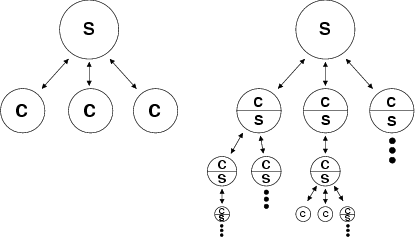
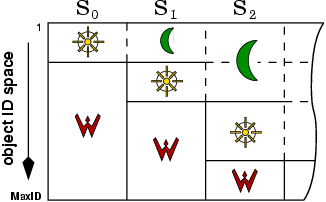
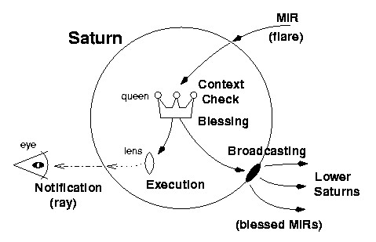
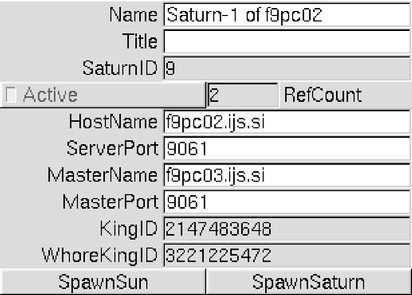
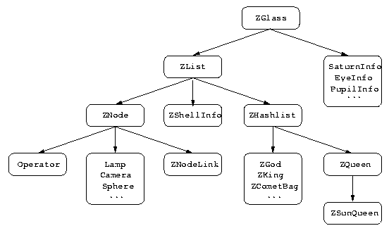

# STATUS

Last edited in June 2003. Converted in 2026 from the HTML on www.gled.org;
the source document is lost.

# NAME

gledparadigms - Gled System / Paradigms

----------------------------------------------------------------------------

# DESCRIPTION

This is a short overview of the most important elements of the `Gled`
system. It is meant as an introduction for users as well as for programmers
and it concentrates on concepts of `Gled` as an object-oriented framework
based on a hierarchic server-proxy-client-viewer model. The document is
split into two major parts:

- Section [The Metaphor of Light](#the-metaphor-of-light) explains the
  main of concepts of `Gled` and is accompanied by introduction to the
  terminological paradigm used in `Gled`. Terminology of `Gled` is rather
  unusual but it corresponds perfectly to the implementation of the system.
  It was invented since no existing metaphor could be bent enough to
  represent `Gled` satisfactorily.
- Section [Overview of Basic Lens
  Functionality](#overview-of-basic-lens-functionality) presents the
  core classes of `Gled` (those, that can be sub-classed to write additions
  to the `Gled` system) and demonstrates the most important aspects of
  programming in `Gled`.

Knowledge of `C++` is presumed. Reading `gledimp` (
<https://github.com/gled-project/gled/blob/main/docs/gledimp.md> ) and *Gled -- an
Implementation of a Hierarchic Server-Client Model* (
<https://www.gled.org/docs/> ) is recommended.

----------------------------------------------------------------------------

# The Metaphor of Light

`Gled` offers a framework for manipulation of arbitrary object graphs which
can be used for development of algorithms and applications by sub-classing
of `Gled`'s base classes. The `Gled` framework provides object graph
synchronization and remote method execution facilities. Both these features
are available in a context of a cluster of machines running `Gled`, where
each instance of `Gled` is part of a server-client tree, sharing the object
graph with other instances. Full programming and interactive control over
cluster configuration, object sharing, remote method invocation,
authorization, permission and ownership of resources is provided, making
`Gled` a general platform for interactive object-oriented cluster computing.

`Gled` is composed of three parts: a server, a client and a viewer. Objects
in `Gled` can be thought of as residing in the server, their copies residing
in the client, and their partial representations residing in the viewer.

Because of the way `Gled` copies objects from servers to clients and from
clients to viewers, *light* was found to represent a good metaphor of the
process. The server shines light: it is called *Sun* and objects registered
in it are said to be *enlightened*. The client reflects light and it is
called *Moon* and objects copied to the Moon are said to be *reflected*. The
viewer accepts light and processes it into visual representations: it is
called *Eye*.

For this metaphor to be meaningful, one has to imagine objects as things
that interact with light: the base class in `Gled` is called *glass* and is
defined in the C++ class `ZGlass`. This class implements basic functionality
of `Gled` objects and all classes inheriting from this class can be thought
of as *glasses* or *gled classes*. An instance of a glass, an instantiated
`Gled` object, is called a *lens*.

## Gled Clusters: Trees of Saturns

A `Gled` executable spawns a server-proxy-client object called *Saturn*. A
*Saturn* can manifest in two ways: as a pure top-level server called the
*Sun Absolute* (as it does not use the proxy-client abilities of *Saturn*),
or as a server-proxy-client.

The Sun Absolute is the top of the tree of servers, the server-client
hierarchy of a `Gled` cluster. Another *Saturn* can connect to it and become
its client. But all *Saturns* are also servers, accepting connections of new
child *Saturns*. They do not only service their clients, but also function
as proxies, routing data between their clients and their upper-level server.
Therefore, each *Saturn* is a Moon (a proxy-client) and a Sun (a server).
The name *Saturn* was chosen since planet `Saturn` both reflects the light
of Sun and shines its own light: it is Sun and Moon (in terminology of
`Gled`) at the same time. In this way, *Saturns* form a hierarchic tree of
client-servers.

**Comparison of traditional server-client architecture with `Gled`'s
hierarchic structure of Saturns.**

In traditional server-client architectures, one server `S` communicates with
a number of clients `C`, which operate on the same level. In `Gled`, each
Saturn `S/C` is both a server and a client, resulting in a tree of
server-clients. Saturns function also as proxies, routing data between their
clients and their server as nodes of a fully connected hierarchic cluster.

## Inside of Saturns

Each Saturn is a Sun: lenses can be enlightened (instantiated) in its server
object ID space. It is said that such enlightened lenses are *ruled* by a
given Saturn and harboured in its *sun space*. From implementation's point
of view this means that each lens is allocated an object ID in the specific
server ID range called the sun space. Object IDs are positive integers, used
for unique identification of a lens in the hierarchic structure of Saturns
and an ID space is simply an interval of IDs.

Each Saturn (except the Sun Absolute) is also a Moon: it reflects lenses
from the Suns above it, creating copies in its client object ID space: the
*moon space*. Both sun-lenses and moon-lenses are \`\`exported'': they can
both be made available to Saturns that connect to a given Saturn and are
then reflected down the tree of the cluster. In this manner, a Saturn also
behaves as a proxy.

Each Saturn provides a third object space, called the *fire-space*: lenses
instantiated in this space are never exported: they can not be reflected by
any other Saturn and remain local to the current Saturn.

**The structure of ID spaces**

`S0` represents the `Sun Absolute` which has only Sun space and Fire space;
in each Saturn, a new Moon space is added at the end of the object space.
Since Moon spaces are added sequentially, respective ID's of mirrored
objects always correspond and no ID demangling is necessary.

## Kings and Queens

The house-keeping of three distinct object ID spaces is facilitated by
ruling agents, called *kings*. Kings divide Saturn's object ID space in
partitions. Each Saturn has a *King* for its sun space and a *Fire-King* for
its fire space, and all but the Sun Absolute have one *Moon-King* for each
Saturn above it. Kings can be conceived as an object-representation of the
object ID space partitioning of a given Saturn.

Kings delegate their executive power to arbitrary number of *queens*. A
queen can manage all of its king's ID space, or just a part: it represents
the minimal chunk of ID space that can be reflected/unreflected by connected
Saturns. Besides aggregation (or logical partitioning) of ID space, they
provide the actual lens instantiation and also verification, authentication
and permission control services for lenses inside their ID space (see
further, [Propagation of Light](#propagation-of-light)). In this way,
Queens are object-representation of object meta-data concerned with their
functioning within a `Gled` cluster.

The ruling King of Sun Absolute possesses a special queen: the *SunQueen*.
The SunQueen contains a representation of the `Gled` cluster hierarchy as a
lens graph. All Saturns are required to reflect it (it is said to be a
*mandatory Queen*), making cluster meta-data accessible to all Saturns
connected into the cluster. In this way, all Saturns know for each other and
can use this information to perform tasks related to cluster administration
and monitoring.

## Streaming, Queens and Comets

`Gled` uses `ROOT`'s serialization (or *streaming*) facilities to deal with
storage and transfer of object data. An object is *streamed* when the
permanent data of the object is written into a linear buffer (stream). Such
buffers can be used to transfer `ROOT` objects over the network or store it
in a file or a database. `ROOT` provides facilities for streaming of objects
and reconstruction (or deserialization) of objects from streams. Glasses are
specializations of `ROOT` objects and `Gled` uses these facilities for lens
storage, large data transfers and initial synchronization of Saturns.

When a new Saturn (Sn) connects to a cluster, it first gets a status update
from the Saturn (Si) it is connecting to. The status update contains:

- A streamed **list of all Kings** of Saturn Si, with exception of the
  Fire-King. This means a sequential list of Moon-Kings followed by the
  ruling King of Si. In the case that Si is Sun Absolute a single King is
  streamed.
- Each King in the sequence is followed by a **list of its Queens and their
  dependencies** (but not the lenses in their ID spaces). The connecting
  Saturn instantiates reflections of Kings and Queens with their respective
  object ID intervals and now possesses a complete object ID space
  partitioning data of its server-client branch.
- The **complete SunQueen** (with all of its lenses), which contains cluster
  meta-data and already includes the object that will be used to represent
  the Sn in the `Gled` cluster. The server-client hierarchy is represented
  with lenses of class `SaturnInfo`, which contain detailed information
  about all Saturns in the hierarchy.

Once the newly connected Saturn has all the cluster metadata, it can reflect
the available Queens by sending a request to its master Saturn Si. Si
answers this request by sending Sn a streamed copy of the required Queen.

Streaming (or serialization) is implemented via a special object, called a
*comet*. It provides methods for streaming of lens collections into a buffer
that can be written to a file, in a database or, of course, transmitted over
the network and reconstructed on the other side. There are three basic types
of comets:

1.  **King comets** are used for production of King-space summary
    information to be sent to a connecting Moon. They contain the King
    itself and all its Queens and a list of their dependencies.
2.  **Queen comets** are used for production of a copy of a Queen-space that
    is to be reflected by a lower Saturn. It contains all lenses ruled by a
    given Queen.
3.  **Comet-bag comets** are used when a list of lens sub-graphs needs to
    serialized. Pointers to lenses that will become entry points into the
    sub-graphs are stored in a special list-object, called a *comet-bag*.
    The comet-bag is then instructed how to follow the object-graphs
    stemming from the provided lenses and how deep the graph traversal
    should be. In this way, a comet-bag is a representation of a list of
    object sub-graphs.

The comet object provides sophisticated infrastructure for automatic
rebuilding of lens graphs, including references to external lenses (not
contained in the stream, but available on the receiving Saturn), at the
moment of deserialization.

Lenses from a given Queen Q0 can reference lenses from another Queen (say,
Q1), but prior to referencing itself an intention has to be declared by
adding Q1 to Q0's list of dependencies. Then **Q0 depends on Q1** and Q1
must be reflected prior to Q0 or graph-rebuilding would result in unresolved
references. Mechanisms to resolve dependencies and enforce proper reflection
order are incorporated into the King glass.

(It seems that Saturn would be a more natural choice. Probably a queen
reflection would fit well into a dedicated Saturn thread.)

Comets are used when a Saturn needs to reflect a large part of the object
graph, but a more efficient method is used for its synchronization with
respect to minimal lens-changes (see further, [Propagation of
Light](#propagation-of-light)).

## Special Queens

Queens can also use streaming for other purposes, such as storing and
recreating object collections in files or databases. The most important kind
of such special-purpose Queen is the *IceQueen*: lenses in an IceQueen are
*frozen*, meaning that they can not be changed. For this reason, any Saturn
that has acquired a copy of a given IceQueen does not need to keep it
synchronized with other Saturns. This can be used for static object
libraries needed for computing or visualization (3D-models, textures, etc)
algorithms.

The same principles could be used by other special Queens that provide
interfaces to different data storage and manipulation systems and would be
named after their special function: FileQueens, SQLQueens, LDAPQueens,
DBQueens etc.

XXX I predict semantic and class-hierarchy debacle here: Queens now
represent the way a lens is accessed and the way a lens is
instantiated/stored. This sucks. What if I want an IceQueen that is also a
SQLQueen? I propose adding Wombs, which are pointed to by `mWomb` links in
the queens. Wombs govern the way lenses are instantiated with special
instantiation methods, and how they are stored or frozen. I want Different
semantic approaches for instantiation, access demangling (SQL selects etc),
deserialization and serialization: I want to be able to make a Queen which
uses a SQLWomb for instantiation requests (`*ZWomb mGetWomb`) and LDAPWomb
for storage request (`*ZWomb mSetWomb`), so that I can transport my data
from one back-end to the other easily, and process it in the middle with
`Gled`.

## Propagation of Light

In `Gled`, information is metaphorically represented as light. Synchronised
modifications of object graphs in the cluster are therefore represented as
propagation of light. When lens-methods, a scripting environment or GUI
wants to modify internal state of a lens (including the lens graph itself),
it must issue a *method invocation request* or *MIR*. MIR is a streamed
message, composed of the following elements:

- The identity of the **caller** and possibly the **recipient** of the
  request.
- The **context** of the request, containing the targeted lens and all
  lens-type arguments for the call.
- A **unique identifier** of the method to be invoked.
- The remaining (non-lens) arguments.

There are two types of MIRs: a *flared* (or broadcast) MIR is the more
common type, used for synchronised method execution on all Saturns
reflecting the lens in question. A *beamed* MIR is sent to a specific Saturn
(recipient) only and can be used to initiate specific per-Saturn tasks that
allow `Gled` to behave as a platform for distributed computing.

A MIR is posted to the Saturn which is executing the code, script or GUI
that produced the MIR. The Saturn then has to decide how to handle (or
*route*) the request. There are five routing situations:

**(a)**    
If the target lens is in its fire space, it can be passed to the Queen that
manages the lens immediately.

**(b)**    
If the target lens of the MIR is in its moon space (managed by a Moon-King,
meaning that only a reflection of a lens is available and the original lens
is ruled by a Saturn higher in the cluster hierarchy), the MIR has to be
routed upwards to the next Saturn, which will repeat the routing decision.

**(c)**    
When a MIR reaches the Saturn that rules over the target lens, the MIR is
passed to the Queen that manages the lens in question. (This happens when
the MIR has reached the top Saturn it can access in the cluster hierarchy;
higher Saturns have no notion of the target lens (its ID belongs to their
fire-space) and can never receive this MIR.) The Queen performs
authentication and permission checks on the request, based on the caller and
the context of call. If the MIR passes the checks, it is said to be
*blessed* by the Queen and the Saturn proceeds with its broadcasting and
execution. Otherwise an error is returned to the caller.

**(d)**    
If a Saturn receives a blessed MIR (i.e. from its master Saturn), it
immediately broadcasts the request and executes it without performing any
checks. All of its Moons (connected Saturns) that reflect the Queen of the
target lens will repeat the same routing decision, broadcasting and
executing the blessed MIR. In this way the method is invoked in parallel on
the whole cluster, preserving object graph synchronization with minimal
overhead.

**(e)**    
Beamed MIRs are routed via the common parent of the initiating and receiving
Saturn. Upon reception the Saturn proceeds with blessing and execution of
the MIR. The method executes only on the receiving Saturn and therefore must
not change the shared data of lenses. Typically a beamed MIR results in
initiation of complex computation which exports its final results to the
rest of the cluster by using flared MIRs.

**Execution of a flare (broadcast MIR)**

As a MIR arrives into the `Saturn` that rules the target lens of the
request, its Queen performs context and permission checks and blesses the
MIR. The Saturn then accepts the blessed MIR, broadcasts it to all lower
Saturns and executes the method on the lens. All lower Saturns, receiving
the blessed MIR, execute it immediately, performing the same action and thus
maintaining consistency of the object graph. After execution, lens sends
change notifications (`rays` to any connected Eyes (viewer processes), so
that they can update their representations of the lens if necessary.

The two types of MIRs provide facilities for synchronized method execution
on the cluster as well as for distributed execution and sharing of results.
They are fast and network-efficient compared to synchronization with
streaming, thus streaming should only be used for initial synchronization
(reflection of whole Queens) and sharing of lens sub-graphs that present a
result of a CPU intensive computation.

## Thread Execution Support

A Saturn provides thread execution support via an instance of a class
*Mountain*. Lenses that need to acquire their own threads must be
sub-classed from the *Operator* glass. The actual thread invocation is
requested by an operator itself (there is, currently, a one thread per
Operator limit). Upon start-up of the thread the Mountain simply calls the
virtual method *Operator::Operate()*.

Operators can perform computation, periodical tasks, monitoring and
reporting or even spawn and control new processes.

YYY Basic operator flags that control the thread invocation on moons.

YYY Flags that control repetition and inter-operate sleep

YYY Priority and scheduling (not planned so far, must be root)

XXX Adding an explanation of *recursion control flags*.

## Inside the Eye

Each Saturn can, optionally, spawn one or more viewers or *Eyes*. The Eye is
a user-interaction front-end: it provides GUI access to lens-graphs, GUI
access to variables and methods of individual lenses (scripting is planned).
GL rendering is supported via a *Pupil* class which provides a visual
representation of objects. Each Eye can spawn multiple Pupils.

In an Eye a lens is represented by its `image` which contains a direct
pointer to the lens and lists of its actual representations (*views*). In
principle an Eye is a relay between objects on the Saturn and their
representations, offering interactivity.

The core representation of an object is called an *image* and from it stem
an arbitrary number of actual representations called *views* (eg. GUI
widgets). An image contains a direct pointer to a lens and a list of
dependent views. Via this pointer the views have read-only access to
lens-data (currently read-onliness is not enforced, but will be when Eye is
implemented as a separate process with read-only access into the shared
memory exported by the Saturn) and they use it to create visual
representations and perform updates. Views are not, in general, a complete
representation of a lens but rather a partial representation that serves a
certain purpose.

There are two families of view-classes that are directly visible to a user.
They both sub-class the basic view and `FLTK` widgets, inducing a coupling
of `Gled` system with the GUI toolkit.

- The **FTW family** (Forest-Tree-Widgets) enables a user to navigate and
  modify the lens-graphs composed of lists of lenses and references to other
  lenses. Further, they provide a generic interface to creation of arbitrary
  MIRs.

- The **MTW family** (Member-Transaction-Widgets) provides interface to
  member data. A `MTW_View` is composed of several parts, each of them
  representing a specific `C++` class in the class-hierarchy of a given
  glass. The class definitions, containing additional information (see
  section [Lens Member Variable
  Interface](#lens-member-variable-interface) bellow), are parsed by
  the `Project7` parser-code generator which produces a glass-specific
  sub-class of a common base `MTW_SubView`. (These sub-view classes are
  named `<glass>View`, e.g. `ZGlassView` or `SaturnInfoView`.) The
  appropriate sub-views are then stacked together to form a particular view.

  YYY Methods wo/ arguments as buttons. Glass as a state machine

  YYY Two options: full-view, custom view swallowed into FTW for tabular
  editing

**MTW_View for a lens of glass SaturnInfo.**

The widget for `SaturnInfo` shows Saturn metadata in its member variable
widgets. The white text widgets represent values that can be modified, the
grayed ones are read-only. The four top rows represent the `Glass` view
(`Name`, `Title` and `SaturnID` are object member variables; `RefCount` is
reference count for object graph references (see ["Links"](#links)), and the
Active button shows whether the lens is accepting MIRs. The rest of the
widget is the `SaturnInfoView`, with member variables and two method
invocation request buttons related to Saturn and its function.

The Eye is implemented as a distinct entity. It communicates with its Saturn
using a network socket, sends MIRs to manipulate the lenses and it accepts
change notification events from the Saturn, called *rays*. Rays are
generated by glass-methods that modify a lens or part of the lens-graph and
are passed to the Saturn which marks them with a *time-stamp*. The emission
of rays is arbitrary, but seems like a good idea if views are to remain in
synchronization with the actual state of the lenses they represent. The
time-stamp of the change is also returned to the calling lens where it can
be stored into a member variable that can be used by complex views to
determine whether certain secondary representation needs to be recalculated
(e.g. internal time-stamps are used by rendering classes to determine
whether a complex re-triangulation, based on member data, is needed).

The rays are sent by the Saturn to all the connected Eyes. Each Eye then
locates the views that need to be updated (via image of the lens) and calls
the appropriate update method.

The ray contains type of change that has occurred, the pointer to the lens
(and other pointers to lenses that are needed to perform the update
(especially for changes in list contents)). It can also contain the class ID
of the glass that has changed which enables the Eye to perform a nearly
optimal update of the views.

----------------------------------------------------------------------------

# Overview of Basic Lens Functionality

The basic functionality of lenses, as implemented by the base classes,
collected in the `gled` libset (see further), provides an interface to the
`Gled` system: object (lens) instantiation and destruction, class member
variable manipulation, method invocation and object aggregation with
arbitrary *links* which provide a general semantic extension for lens
aggregation. Links are used also in building of *lists*, a glass that
provides container functionality, and its specializations, providing custom
aggregation classes.

## ZGlass

`ZGlass` is the base class for all glasses (*gled object classes*): it
provides an interface to basic facilities of `Gled`. All other classes whose
instances are to be members of `Gled` object collections must inherit from
`ZGlass`.

**Inheritance tree of Glasses (`ZGlass` and descendants)**

As `Gled` (and `ROOT`, as of `Gled` version 1.1.7 and `ROOT` version
3.03-09) only permits single-inheritance, the structure of gled classes is a
simple tree.

Many base features are implemented as specializations of `ZGlass` (`ZList`,
`ZNode` etc.) and parts of infrastructure are also provided by ZGlass
specializations (`SaturnInfo`, `ZGod`, `ZKing`, `ZQueen`, `ZSunQueen`,
etc.). Parts of `Gled` itself are therefore accessible with the Eye's
interactive GUI and can be administrated with ease.

## Instantiation of lenses

Gled defines an extension interface with *library sets* or *libsets* and
provides dynamic loading and name-space support for libsets. The
functionality is provided by `GledNS` and `GledViewNS` classes which use
*library ID* (LID) and *class ID* (CID) with autogenerated glue code and
class dictionaries, provided by `ROOT`'s `rootcint` and `Project7` code
preprocessor/generator. These services are needed for MIR processing and
streaming, so all glasses have to be part of a libset. `Gled` base classes
are defined in the `gled libset`.

These allow the Eye's GUI and C++ code in lenses to query available classes
in a libset and request instantiation of a new lens from a given class,
optionally specifying its future location in the object graph. This request
generates a MIR for one of the Queens of the Sun where the new lens is to be
instantiated (specifically, the MIR is routed to the Saturn which is going
to have the new lens in its sun-space; the Queen then blesses the MIR and
executes it, broadcasting it to all Saturns that reflect the given Queen).
The MIR contains a request for invocation of method
*instantiate_with_attach*, followed by a `*ZGlass` (pointer to `ZGlass` or
lens pointer) to the lens the new lens is being attached to, then libset ID
and class ID for the new lens.

The queen then calls `GledNS` method *GledNS::ConstructGlass()* which is the
canonical way for lens instantiation (XXX and will, hopefully, soon be
renamed to *ContructLens()*, since *ConstructGlass()*, in current `Gled`
terminology, implies sub-classing a glass ...) with the library and class
IDs. GledNS creates an instance of the `C++` class, performs all
initialization procedures and returns the new lens. The Queen performs a
check-in of the new lens, assigning it a new ID and *enlightening* it by the
Saturn (registering it with the server). Then, the Queen makes the new lens
the target of the method invocation procedure, and executes the rest of the
Method Invocation Request, which is the actual attachment of the target lens
in its new space in the object graph, relative to the lens referenced by the
glass pointer argument.

When enlightened by the Saturn, the *Saturn ID* and *Saturn pointer* are set
in the lens to point to the local Saturn (and are therefore different for
each reflection of a given lens!). This is gives the lens access to the
Saturn so that it can post its Method Invocation Requests, which the Saturn
will route according to rules given in section [Propagation of
Light](#propagation-of-light). A new lens is usually also assigned a
Name and a Title (member variables `TString mName` and `TString mTitle`,
with accessor methods and widgets provided by `Project7`. (See next
section.)

Since all reflecting Saturns get broadcasts of the same MIR, the same
instantiation procedure is performed on all Moons, reflections of the
original lens get created with the same arguments and object graph
consistency is preserved automatically.

This is an example that clearly shows how implementing parts of `Gled`
infrastructure (Queens, in this example) as glasses makes it possible to use
facilities of `Gled` for implementation of is core services, making
implementation easier, more transparent and robust.

## Lens Member Variable Interface

`Gled` uses `Project7` to provide simple syntax for object member variable
declaration where variables are automatically provided with accessor
(get/set) methods that obey the MIR and stamping requirements of `Gled`. The
member variables need just be declared in the header, and a `Project7`
command in the comment instructs `Project7` to provide the necessary code
glue that is generated in the `<classname>.c7` and `<classname>.h7`
files, included in the main header and source files.

Examples from `ZGlass`:

              Saturn*       mSaturn;        //! X{G}  //Exclamation mark
              ZQueen*       mQueen;         //! X{G}  //disables ROOT streamers
              ZContext*     mCtx;           //! X{Gs} //for Saturn-local members

              TString       mName;          //  X{GS} 7 Textor()
              TString       mTitle;         //  X{GS} 7 Textor()
              ID_t          mSaturnID;      //  X{G}  7 ValOut(-range=>[0,4294967296,1,0],
                                            //                 -width=>10)
              Bool_t        bActive;        //  X{GS} 7 BoolOut(-join=>"true")
              Short_t       mRefCount;      //! X{G}  7 ValOut(-width=>4)

This declares `mSaturn` member variable, which is a pointer to a `Saturn`
and gets an eXported Get method defined. A more complicated example is the
`mName`, which is a `Tstring` (`ROOT`'s string), has exported get and set
methods, using a `Textor` widget (editable text) for the GUI. The boolean
member variable `bActive`, for example, also has exported get/set methods,
but with an interactive boolean radio-button widget. Note read-only (get
method only) members with widgets definitions that permit proper updating of
the widgets.

**Anatomy of widgets**

Picture of the full-view widget for an instance of the `SaturnInfo` class.
The top four rows belong to parent class `ZGlass`.

The interface to the member variables are the accessor (get/set) methods,
constructed by prefixing the variable name with `Get` or `Set` (ie.
*GetName()* and *GetTitle()*, *SetName()* and *SetTitle()*). The standard
lens method interface is used for accessor methods. (see further).

Besides `G`, `P` can be used to generate method that returns pointer (prefix
`Ptr`) and `R` for method that return a reference (prefix `Ref`) to given
variable. Capital versions (`GPR`) produce methods that return `const`
objects, while lowercase version return non-const objects.

Using a lowercase `s` will generate a `Set` method, that does not produce a
time stamp (i.e. does not send notifications to viewers).

## Lens Method Interface

Lens methods can be called either directly or using the Method Invocation
Requests (MIRs). It is important to understand that using the MIR layer is
mandatory to allow for consistency of object collections in different
saturns, but recursive usage of MIR layer is undesirable. This can be summed
up in a simple rule: in a method that was called with a flared MIR, direct
method calls are of order, but in a method, called with a beamed MIR, flared
MIR method calls are necessary to synchronize the cluster. XXX I am more and
more convinced that the context of current execution should be kept somehow.

A MIR is constructed from a Method Invocation Request class, called `MIR`.
The *context* of a MIR consists of the *caller ID*, *recipient ID*, three
context arguments, called *alpha*, *beta*, *gamma*, a *message_type* and the
message itself, which contains the method ID and any actual arguments for
the method. A `MIR` object is posted with the current Saturn and thus
becomes a MIR: a streamed message which is routed to the Sun of the lens in
question where it gets authenticated and broadcast to all reflecting
saturns, and is then executed concurrently in the `Gled` cluster hierarchy,
maintaining object collection consistency of the cluster.

(See section [Propagation of Light](#propagation-of-light) for
explanation of the invocation and routing process for MIRs.) XXX Perhaps
this needs to be rewritten. Which terminology was better, there or here?

MIRs use infrastructure, provided by the `Project7` preprocessor/code-glue
generator. Each externally accessible method is called an *exported method*
and is marked with the `Project7` command X{E} in the header file). For each
such method `Project7` defines a Method ID (MID) and produces glue code for
streaming, recreation of method call, ID demangling and execution of the
actual method. (The autogenerated accessor methods are handled in the same
fashion, with the only exception that `Project7`, in this case, provides
also the methods themselves since only member variables are specified by the
user.)

`Project7` defines also a *streaming* version of each method, prefixed with
`S_`: this returns a `MIR` object that can be posted to the Saturn and so
the method is executed using the MIR interface. This is *the preferred way
of calling methods in other lenses*.

Let's see an example from `Zlist`:

              virtual void Add(ZGlass* g);                       // X{E} C{1}
              virtual void AddBefore(ZGlass* g, ZGlass* before); // X{E} C{2}
              virtual void AddFirst(ZGlass* g);                  // X{E} C{1}
              virtual void Remove(ZGlass* g);                    // X{E} C{1}
              virtual void RemoveLast(ZGlass* g);                // X{E} C{1}

This declares five virtual methods, returning void values. They are all
exported for execution (with the `X{E}` `Project7` command; `Project7`
commands are always specified in `C++` comments), and the number of
arguments they take from the MIR context is provided with the `C{}` command.
In these cases, it matches the number of arguments of the function itself.

When calling one of these methods, we should never call the method directly,
but instead its *streaming* version should be called
`ZList::S_AddBefore(ZGlass* g, ZGlass* before)`. This builds a `MIR` object,
posts it to the `Saturn` which makes a MIR of it, routes it to the Sun of
the lens, where it gets authenticated and then broadcast until finally the
actual method (`AddBefore(ZGlass* g, ZGlass* before)`, in this case) gets
executed on every `Saturn` that has a reflection of the lens.

Calling the actual method itself from a method that was not itself called by
a flared MIR would quickly disrupt the synchronization of the object
collections in the cluster. *Call methods directly only when you know what
you are doing (or when you are doing it in the fire space.)* Understanding
the difference between flared and beamed MIR context is crucial for `Gled`
programming, however, since flared MIR calls from flared MIR calls can cause
unnecessary network congestions.

XXX Widget example: We need to explain how me make method calls widgets ...

Lens graph manipulation methods that we have seen in the cited example are
not represented as method widgets, however. They are handled with the
special lens graph browsing widget: the `FTWNest` (for *forest-tree widget*,
try to think of a better name). It is usually used as a part of a `FTWShell`
which has its own MIR context selectors, context-menus on lenses for MIR
posting, lens instantiation controls, Pupil and rendering controls etc. All
this is hard-coded in the special widgets, but uses `Project7` glue code
and services from GledViewNS and GledNS support classes.

XXX Context menu example

XXX Manual-context construction example

XXX Context pointer

Instructions for interactive usage of these widgets can be found in
`gledgui` ( [gledgui.md](gledgui.md) ).

## Associations and Collections of Lenses

`Gled` provides two mechanisms for association of lenses: *links* and
*lists*. Links are specially treated pointers to glass (`*ZGlass`) and lists
are specializations of `ZGlass`, implemented in glass `ZList`: they provide
a collection of links with add and remove methods.

A lens can have any number of links, but links must always be declared as
members of the class and are therefore fixed by the class declaration. Lists
use methods for manipulation of variable-length collection of links,
implemented in glass `ZList`. A lens which subclasses `ZList` can, of
course, also declare links and use both mechanisms. Advanced aggregation is
provided with combinations of these two features since links and
list-members can point to other lists. This allows for arbitrarily complex
data structures built with lenses.

Links can be considered as simple pointers, lists as collections (or
containers), links to lists as pointers to a collection, and subclasses of
`ZList` as specialized containers.

## Links

Links are class-member pointers of a lens to another lens (a `ZGlass` or
`ZGlass` descendant instance). A link is created simply by marking its
declaration with `Project7` instruction `Link` such as this:

              ZGlass*       mLinkName;              // Link{} Xport{GS}

or

              ZGlass*       mLinkName;              // L{} X{GS}

`Project7` code generator processes its commands in the comments of
declarations in the header and provides the necessary code glue. Note that
you must still explicitly export the variable. (The command for link can be
abbreviated to `L`. It also takes an option:

**l**    
link to list: the lens pointed to by this link is a list. Example:

              ZList*        mListName;              // L{l}

XXX This is needed for GUI and renderer treatment of links to lists, and
could possibly go away in a future version. In fact ... it is not used
anymore, but the entry is still present in the glass catalogue.

Links always provide reference counting for the lenses pointed to. Reference
counting for links permits special treatment of lenses that have no place in
the object graph, but have not been destroyed (`refcount = 0`): they are put
in a virtual list, called the *orphanage*, where they can be accessed by the
GUI. Methods are provided for removal of such lenses (simplified garbage
collection).

Autogenerated method `Set<linkname>(<linktype>*)`, if called as
`Set<linkname>(<ZGlass>*)`, attempts a dynamic cast and, if the cast
succeeds, calls the true set method. In this way, linking methods are
generalized. This is also used by the GUI, which generally does not care
about the glass of the lens that is linked.

Streaming and stamping support is provided for links.

Streaming support is implemented in `ZComet` class which uses a
`Project7`-generated virtual function `CopyLinks()`. This method is defined
for all glassses and retrieves parent-glass links recursively. The `ZComet`
class collects the referenced lenses and provides the actual streaming
methods.

Stamping support is described in section [Time-Stamping and
Callbacks](#time-stamping-and-callbacks). When using autogenerated
accessor methods, stamping is taken care of automatically.

## Lists

`ZList` is a direct descendant of `ZGlass`, extending it with a simple list
of pointers to lenses and infrastructure needed to make it work as a list of
lenses in the `Gled` environment. This includes (recursive) streaming of
lens collections and special stamping mechanism that notifies the system
about list operations being performed.

In particular, viewing and rendering are made very flexible (and quite
complicated) by special treatment of links, lists and links to lists.

The programming interface for lists consists of five methods, provided by
`ZList`:

              virtual void Add(ZGlass* g);                       // X{E} C{1}
              virtual void AddBefore(ZGlass* g, ZGlass* before); // X{E} C{2}
              virtual void AddFirst(ZGlass* g);                  // X{E} C{1}
              virtual void Remove(ZGlass* g);                    // X{E} C{1}
              virtual void RemoveLast(ZGlass* g);                // X{E} C{1}

*Add(g)* adds the lens *g* to the end of the list (push), *AddBefore(g,
before)* adds the lens *g* before the lens *before* which must already be in
the list (insert), and *AddFirst(g)* adds the lens to the beginning of the
list (unshift).

*Remove()* and *RemoveLast()* both remove a lens from the list and a pointer
to the lens has to be passed as the argument. *RemoveLast()* removes the
last lens in the list, if it corresponds to the pointer it was passed as an
argument. This is to avoid removing a lens that was added to the list after
we last checked it.

For list members, reference counting is always performed.

Streaming and stamping support is provided for lists.

Streaming support is again implemented in the `ZComet` class which retrieves
all list-member IDs using the `ZList::Copy()` method.

Stamping support is described in section [Time-Stamping and
Callbacks](#time-stamping-and-callbacks). When using provided list
manipulation methods in `ZList`, stamping is taken care of automatically.

Lists and links are sufficient for advanced aggregation of objects:
arbitrarily complex object graphs can be constructed with them.
Specializations of lists are used for optimized cases of advanced object
graphs, such as trees and mappings.

## Trees

Tree graphs are implemented in `ZNode` class, using a list to store
descendants of the node, and a link (`*ZGlass mParent`) to store the parent
of the node.

(`ZNode` also contains special transformation matrix, making it useful for
3D scene-building and rendering.)

Other specialized aggregation classes can be constructed as specializations
of `ZList` or `ZNode`: mappings, arrays etc.

## Execution Locks

Before a method starts executing, it should make sure no other method is
called at the same time to prevent inconsistencies since `Gled` instances
are heavily multi-treaded and all Saturns in the cluster can receive MIRs
that are blessed for execution. This is achieved by execution locking with
the `mExecMutex`, provided in the \<`ZGlass`. Example:

            mExecMutex.Lock(); 
            //... modify the lens here
            mExecMutex.Unlock();

It is very important to understand that execution locks can affect
responsiveness of the system if the code inside a lock runs any substantial
amount of time. Any processor-intensive work should be done by spawning a
new thread inside the execution lock and transferring the work to the
operator of the thread so that it is executed asynchronously with the MIR
execution of the cluster.

## Time-Stamping and Callbacks

Every method of a lens that changes the state of the lens in such a way that
any Eyes containing an image of the lens it should update their views,
should issue a *time-stamp* at the end of it execution.

When time-stamps occur as a response to GUI-created MIRs, they are
functionally equivalent to *callbacks* in GUI programming. `Gled` widgets
therefore simply post MIRs to their Saturn. The MIR should eventually be
executed and produce a time-stamp, which should produce a ray (change
notification event) that arrives to the Eye and informs it which views to
update.

The modification is usually immediately followed by a *Stamp()*:

            mExecMutex.Lock(); 
            //... modify the lens here
            mExecMutex.Unlock();
            Stamp(LibID(), ClassID());

Auto-generated set methods take care of their stamping so no extra code is
necessary when modifying a lens through them.

There are several types of time-stamps for reporting lens graph
modifications: *StampLink()*, *StampListAdd*, *StampListRemove()* and
*StampListRebuild*. The time-stamping interface should (perhaps) be
generalized to allow simple additions of new types of change notification
messages.

----------------------------------------------------------------------------

# AUTHORS

Author of `Gled` is Matevz Tadel.

Initial version of this document by Matevz Tadel, rewritten and reformatted
by Matevz Tadel and Jan Jona Javorsek.
